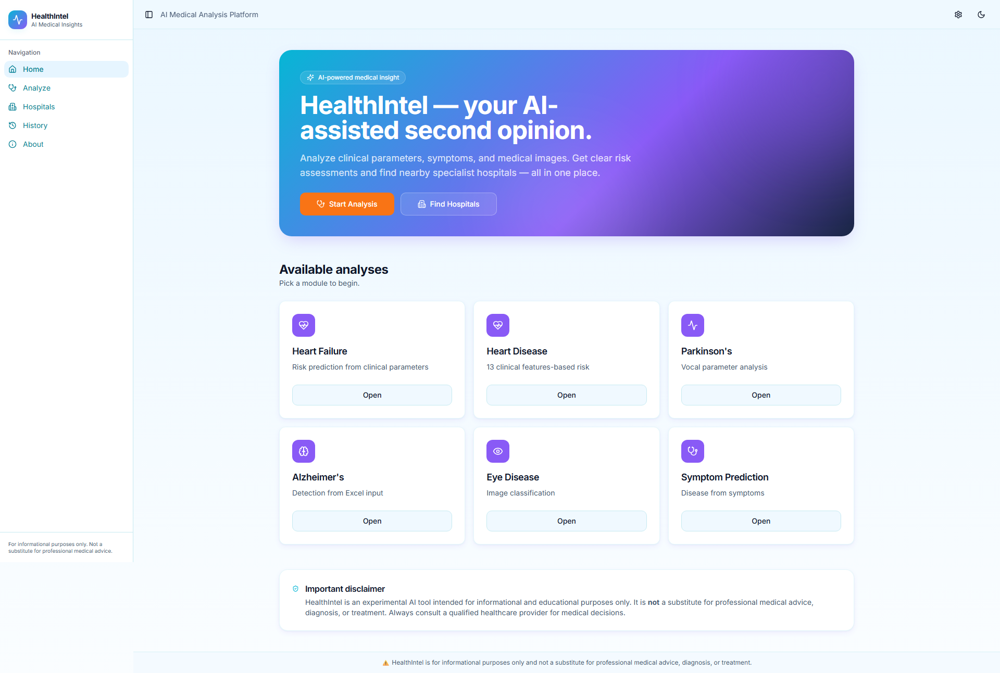
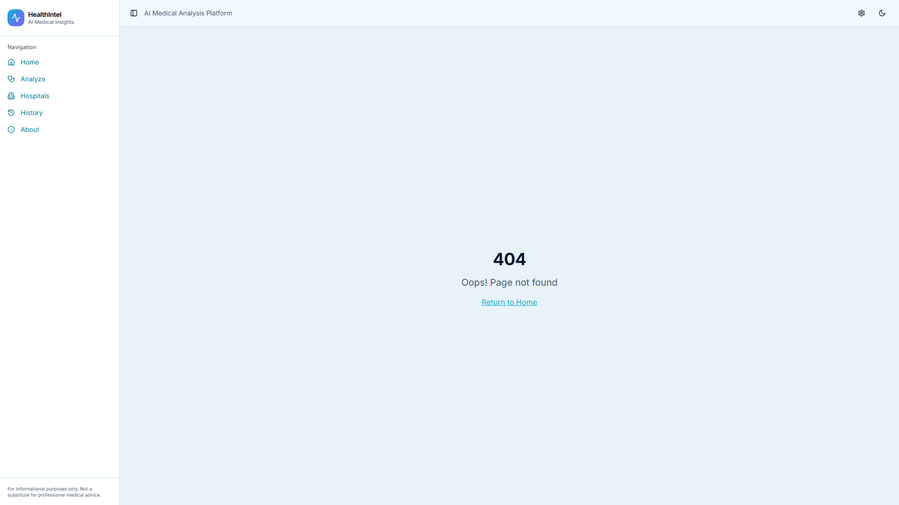
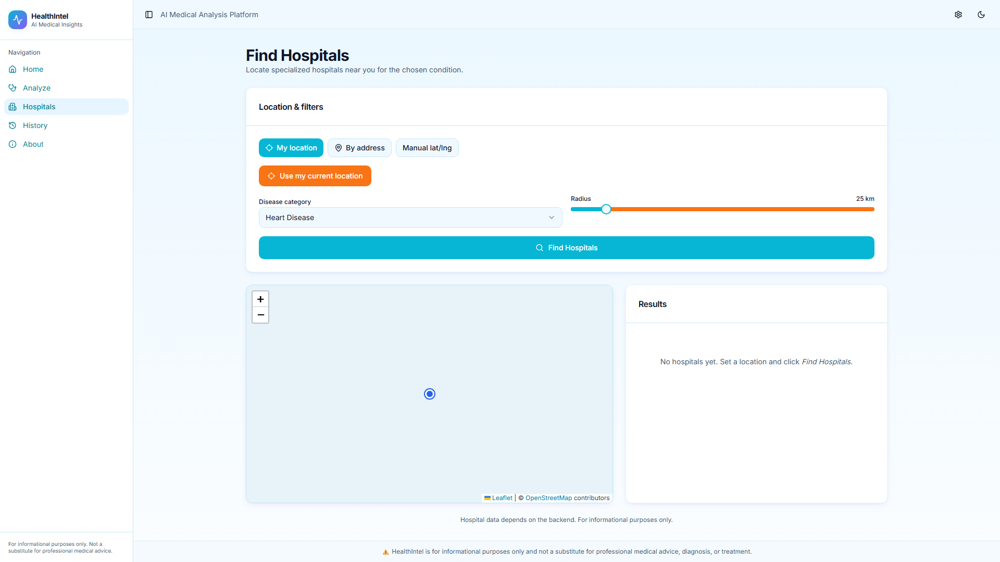
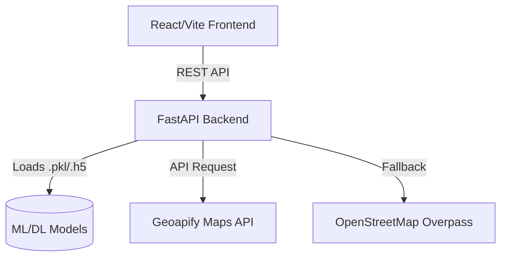

<div align="center">
  
  <h1>Health Intel</h1>
  <p><strong>Advanced AI-Powered Health Diagnostic & Hospital Recommendation System</strong></p>
</div>

<p align="center">
  <a href="#features">Features</a> •
  <a href="#modules">Diagnostic Modules</a> •
  <a href="#architecture">Architecture</a> •
  <a href="#installation">Installation</a> •
  <a href="#usage">Usage</a>
</p>

---

## 🌟 Overview

**Health Intel** is an integrated medical decision-support platform that leverages multiple machine learning models (Deep Learning, Ensembles, and traditional ML) to provide preliminary diagnoses for various health conditions. Following a diagnosis, the system uses geo-location to recommend nearby specialized hospitals.

> **Disclaimer:** This tool is for educational and preliminary screening purposes only. It is not a substitute for professional medical advice, diagnosis, or treatment.

---

## 📸 Screenshots

*(Add your screenshots to a `screenshots` folder in the root directory and they will appear here)*

### 1. Dashboard & Disease Selection


### 2. Diagnostic Interface (e.g., Eye Disease Upload)


### 3. Results & Hospital Recommendation Map


---

## ✨ Features

- **Multi-Disease Analysis:** 6 specialized diagnostic modules integrated into a single unified platform.
- **Ensemble Machine Learning:** Uses Random Forest, XGBoost, and CatBoost voting for symptom-based predictions.
- **Deep Learning Vision:** Utilizes a fine-tuned VGG19 CNN for Eye Disease classification via image upload.
- **Smart Hospital Recommendations:** Automatically detects user location and finds nearby specialized hospitals using the Geoapify API and OpenStreetMap (Overpass API).
- **Modern UI:** Built with React, TypeScript, TailwindCSS, and Shadcn UI for a clean, responsive, and accessible experience.
- **Robust API:** Powered by a high-performance FastAPI backend.

---

## 🧠 Diagnostic Modules

| Module | Input Type | Model | Description |
| :--- | :--- | :--- | :--- |
| **Symptom Prediction** | Categorical | Ensemble (RF, XGB, CatBoost) | Predicts 41 diseases based on patient-reported symptoms. |
| **Heart Failure Risk** | Clinical Data | Random Forest | Predicts mortality risk based on 12 clinical features. |
| **Heart Disease** | Clinical Data | Logistic Regression | Detects presence of heart disease based on ECG and blood tests. |
| **Parkinson's Detection** | Vocal Metrics | XGBoost | Detects Parkinson's using 22 biomedical voice measurements. |
| **Eye Disease** | Image Scan | VGG19 (CNN) | Classifies Retinal scans into Cataract, Diabetic Retinopathy, Glaucoma, or Normal. |
| **Alzheimer's** | Excel/CSV Data | Random Forest | Predicts cognitive impairment stages from MRI and clinical data. |

---

## 🏗️ Architecture



---

## 🚀 Installation & Setup

### Prerequisites
- Python 3.10+
- Node.js & npm

### 1. Clone the Repository
```bash
git clone https://github.com/YOUR_USERNAME/Health-Intel.git
cd Health-Intel
```

### 2. Backend Setup
```bash
# Create and activate virtual environment
python -m venv venv
venv\Scripts\activate  # Windows
# source venv/bin/activate  # Mac/Linux

# Install dependencies
pip install -r requirements.txt

# Set up environment variables
cp .env.example .env
# Edit .env and add your Geoapify API key
```

### 3. Frontend Setup
```bash
cd main_frontend
npm install
```

---

## 💻 Usage

Start the system by running the backend and frontend simultaneously.

**Terminal 1 (Backend):**
```bash
# From the root directory
venv\Scripts\activate
uvicorn backend.main:app --host 0.0.0.0 --port 8000
```
*API Docs available at `http://localhost:8000/docs`*

**Terminal 2 (Frontend):**
```bash
# From the main_frontend directory
npm run dev
```
*Application available at `http://localhost:8080`*

---

## 🧪 Testing

A comprehensive automated test suite is provided to verify all model inference endpoints and API routes.

```bash
# Ensure backend is running, then execute:
python test_system.py
```
For manual testing inputs, refer to the [`demo.md`](demo.md) file.
