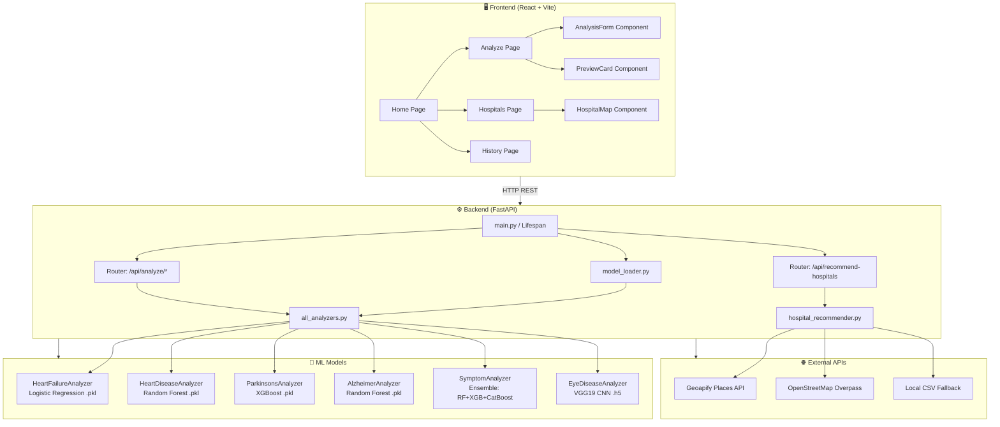
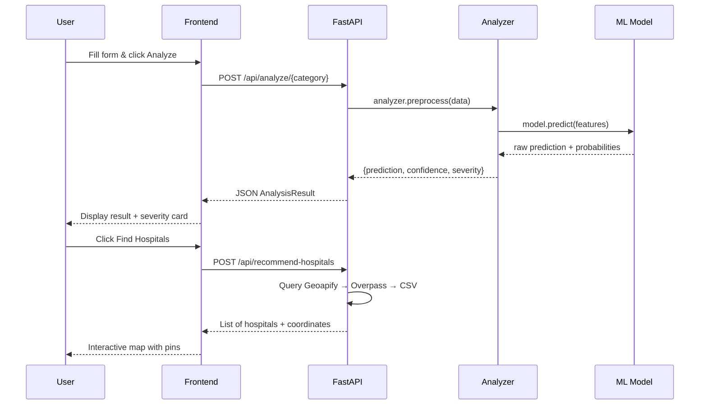

# HealthIntel — Architecture & Technical Documentation

**Author:** Smita Mhatugade | [LinkedIn](https://www.linkedin.com/in/smita-mhatugade-b85a29290/) | [GitHub](https://github.com/Smita-Mhatugade)

---

## 1. System Overview

HealthIntel is a full-stack AI-powered medical diagnostic platform. It consists of a **React/Vite frontend**, a **FastAPI backend**, and **6 machine learning models** for diagnosing various diseases.

```
User Browser
    │
    ▼
┌─────────────────────────────┐
│   React + Vite Frontend     │  http://localhost:8080
│   (TypeScript, TailwindCSS) │
│   main_frontend/            │
└─────────────┬───────────────┘
              │  REST API (JSON / Multipart)
              ▼
┌─────────────────────────────┐
│   FastAPI Backend           │  http://localhost:8000
│   backend/main.py           │
│   ┌───────────────────────┐ │
│   │  Routers              │ │
│   │  ├── /api/analyze/*   │ │
│   │  └── /api/hospitals   │ │
│   └───────────────────────┘ │
│   ┌───────────────────────┐ │
│   │  Services / Analyzers │ │
│   │  ├── all_analyzers.py │ │
│   │  ├── model_loader.py  │ │
│   │  └── hospital_rec.py  │ │
│   └───────────────────────┘ │
└─────────────┬───────────────┘
              │
   ┌──────────┴──────────┐
   ▼                     ▼
models/              External APIs
├── *.pkl            ├── Geoapify (Maps)
├── *.h5             └── Overpass (OSM)
└── symptom_prediction/
```

---

## 2. Full Architecture Diagram (Mermaid)



---

## 3. Request-Response Flow



---

## 4. Directory Structure

```
Health Intel/
│
├── backend/                        # FastAPI Backend
│   ├── main.py                     # App entry point, lifespan loader
│   ├── config.py                   # Env vars, model paths
│   ├── database.py                 # SQLite DB setup
│   ├── limiter.py                  # Rate limiting
│   ├── routers/
│   │   ├── analysis.py             # /api/analyze/* endpoints
│   │   └── hospitals.py            # /api/recommend-hospitals
│   ├── schemas/
│   │   └── schemas.py              # Pydantic request/response models
│   └── services/
│       ├── analyzers/
│       │   └── all_analyzers.py    # All 6 disease analyzer classes
│       ├── model_loader.py         # Loads all models at startup
│       └── hospital_recommender.py # Geoapify + Overpass + CSV logic
│
├── main_frontend/                  # React + Vite Frontend
│   ├── index.html                  # App shell + Health Intel favicon
│   ├── src/
│   │   ├── components/
│   │   │   ├── AppLayout.tsx       # Top navbar + footer + theme toggle
│   │   │   ├── AnalysisForm.tsx    # Dynamic form for each disease module
│   │   │   ├── PreviewCard.tsx     # Result display card
│   │   │   └── HospitalMap.tsx     # Leaflet map component
│   │   ├── pages/
│   │   │   ├── Home.tsx            # Hero + module grid
│   │   │   ├── Analyze.tsx         # Chat + form + results
│   │   │   ├── Hospitals.tsx       # Hospital search + map
│   │   │   ├── History.tsx         # Past analyses
│   │   │   └── About.tsx           # About page
│   │   ├── store/useStore.ts       # Zustand state management
│   │   ├── lib/api.ts              # All API client functions
│   │   └── index.css               # Violet design system + animations
│   └── tailwind.config.ts
│
├── models/                         # Trained ML model files
│   ├── heart_failure_lr.pkl        # Logistic Regression
│   ├── heart_disease_model.pkl     # Random Forest
│   ├── parkinsons_model.pkl        # XGBoost
│   ├── alzheimer_rf.pkl            # Random Forest
│   ├── eye_disease_model.h5        # VGG19 CNN (118 MB)
│   └── symptom_prediction/
│       ├── RandomForest_model.pkl
│       ├── Xgboost_model.pkl
│       ├── catboost_model.pkl
│       ├── LGBM_model.pkl
│       └── naive_bayes.pkl
│
├── data/
│   ├── disease_specialties.json    # Disease → specialty mapping
│   ├── hospitals.csv               # Local hospital database
│   └── symptom_data/
│       └── training.csv            # 132-symptom training dataset
│
├── training/
│   ├── retrain_symptom_models.py   # Retrain symptom ensemble
│   └── train_eye_disease.py        # VGG19 training script
│
├── screenshots/                    # UI screenshots for README
├── test_system.py                  # Full automated test suite
├── demo.md                         # Manual test inputs
├── .env.example                    # Environment variable template
├── requirements.txt                # Python dependencies
└── .gitignore
```

---

## 5. Technology Stack

### Backend
| Layer | Technology |
|---|---|
| Web Framework | FastAPI 0.110+ |
| ASGI Server | Uvicorn |
| Data Validation | Pydantic v2 |
| ML — Tabular | scikit-learn, XGBoost, CatBoost, LightGBM |
| ML — Vision | TensorFlow / Keras (VGG19) |
| Data Processing | pandas, numpy |
| Maps | Geoapify API, OpenStreetMap Overpass API |
| Database | SQLite (via SQLAlchemy) |
| Environment | python-dotenv |

### Frontend
| Layer | Technology |
|---|---|
| Framework | React 18 + Vite 6 |
| Language | TypeScript |
| Styling | TailwindCSS + Shadcn/UI |
| State Management | Zustand |
| API Client | TanStack Query (React Query) |
| Routing | React Router v6 |
| Maps | Leaflet.js |
| HTTP | httpx / fetch |

---

## 6. API Endpoints Reference

### Core
| Method | Endpoint | Description |
|---|---|---|
| `GET` | `/` | API info and version |
| `GET` | `/api/status` | Model availability status |
| `GET` | `/api/disease-config` | All 6 module configurations |
| `GET` | `/api/symptoms` | Full symptom list (132 symptoms) |
| `GET` | `/docs` | Swagger interactive documentation |

### Analysis Endpoints
| Method | Endpoint | Input | Model |
|---|---|---|---|
| `POST` | `/api/analyze/heart-failure` | JSON (12 fields) | Logistic Regression |
| `POST` | `/api/analyze/heart-disease` | JSON (13 fields) | Random Forest |
| `POST` | `/api/analyze/parkinsons` | JSON (22 fields) | XGBoost |
| `POST` | `/api/analyze/alzheimer` | File (.xlsx/.csv) | Random Forest |
| `POST` | `/api/analyze/eye-disease` | File (.jpg/.png) | VGG19 CNN |
| `POST` | `/api/analyze/symptoms` | JSON (symptom list) | Ensemble Vote |

### Hospital Recommendation
| Method | Endpoint | Description |
|---|---|---|
| `POST` | `/api/recommend-hospitals` | Returns nearby hospitals by lat/lng + disease |

---

## 7. ML Model Details

### 7.1 Heart Failure Prediction
- **Algorithm:** Logistic Regression
- **File:** `models/heart_failure_lr.pkl`
- **Output classes:** `0` = Low Risk, `1` = High Risk
- **Features (12):**

| Feature | Type | Range |
|---|---|---|
| age | int | 18–100 |
| anaemia | int (0/1) | Binary |
| creatinine_phosphokinase | int | 23–7861 |
| diabetes | int (0/1) | Binary |
| ejection_fraction | int | 14–80 |
| high_blood_pressure | int (0/1) | Binary |
| platelets | float | 25,100–850,000 |
| serum_creatinine | float | 0.5–9.4 |
| serum_sodium | int | 113–148 |
| sex | int (0/1) | 0=F, 1=M |
| smoking | int (0/1) | Binary |
| time | int | 4–285 (follow-up days) |

---

### 7.2 Heart Disease Detection
- **Algorithm:** Random Forest Classifier
- **File:** `models/heart_disease_model.pkl`
- **Output classes:** `0` = No Disease, `1` = Disease Detected
- **Features (13):**

| Feature | Description | Values |
|---|---|---|
| age | Patient age | 29–77 |
| sex | Sex | 0=F, 1=M |
| cp | Chest pain type | 0–3 |
| trestbps | Resting blood pressure | 94–200 |
| chol | Cholesterol | 126–564 |
| fbs | Fasting blood sugar >120 | 0/1 |
| restecg | Resting ECG | 0–2 |
| thalach | Max heart rate | 71–202 |
| exang | Exercise induced angina | 0/1 |
| oldpeak | ST depression | 0.0–6.2 |
| slope | Slope of ST segment | 0–2 |
| ca | Major vessels (fluoroscopy) | 0–4 |
| thal | Thalassemia | 0–3 |

---

### 7.3 Parkinson's Disease Detection
- **Algorithm:** XGBoost Classifier
- **File:** `models/parkinsons_model.pkl`
- **Output classes:** `0` = Healthy, `1` = Parkinson's Detected
- **Features (22):** All vocal biomedical measurements

| Feature | Description |
|---|---|
| MDVP:Fo(Hz) | Average vocal fundamental frequency |
| MDVP:Fhi(Hz) | Maximum vocal fundamental frequency |
| MDVP:Flo(Hz) | Minimum vocal fundamental frequency |
| MDVP:Jitter(%) | Frequency variation % |
| MDVP:Jitter(Abs) | Absolute jitter |
| MDVP:RAP | Relative average perturbation |
| MDVP:PPQ | Five-point period perturbation quotient |
| Jitter:DDP | Average absolute difference of differences |
| MDVP:Shimmer | Amplitude variation |
| MDVP:Shimmer(dB) | Shimmer in dB |
| Shimmer:APQ3/5 | 3 & 5-point amplitude perturbation |
| MDVP:APQ | 11-point amplitude perturbation |
| Shimmer:DDA | Average absolute differences |
| NHR / HNR | Noise-to-harmonics ratio |
| RPDE | Recurrence period density entropy |
| DFA | Detrended fluctuation analysis |
| spread1 / spread2 | Nonlinear measures |
| D2 | Correlation dimension |
| PPE | Pitch period entropy |

---

### 7.4 Alzheimer's Detection
- **Algorithm:** Random Forest Classifier
- **File:** `models/alzheimer_rf.pkl`
- **Input:** Excel/CSV file with clinical + MRI data
- **Output classes:** `CN` (Normal), `EMCI`, `LMCI`, `AD` (Alzheimer's)
- **Key Features:** MMSE, CDRSB, ADAS11, ADAS13, FAQ, Ventricles, Hippocampus, WholeBrain, Entorhinal, Fusiform, MidTemp, ICV

---

### 7.5 Eye Disease Detection
- **Algorithm:** VGG19 CNN (Transfer Learning)
- **File:** `models/eye_disease_model.h5` (118 MB)
- **Input:** JPG/PNG retinal image (224×224 px)
- **Output classes:** `Cataract` | `Diabetic Retinopathy` | `Glaucoma` | `Normal`
- **Training:** 6 epochs, ImageDataGenerator, 80/20 train-val split

---

### 7.6 Symptom Prediction (Ensemble)
- **Algorithm:** Voting Ensemble (RF + XGBoost + CatBoost)
- **Files:** `models/symptom_prediction/*.pkl`
- **Input:** List of 1–132 symptom names
- **Output:** One of 41 disease classes
- **Confidence:** Calculated as % of models in agreement

**Supported diseases (41):**
Fungal infection, Allergy, GERD, Chronic cholestasis, Drug Reaction, Peptic ulcer disease, AIDS, Diabetes, Gastroenteritis, Bronchial Asthma, Hypertension, Migraine, Cervical spondylosis, Paralysis (brain hemorrhage), Jaundice, Malaria, Chicken pox, Dengue, Typhoid, Hepatitis A/B/C/D/E, Alcoholic hepatitis, Tuberculosis, Common Cold, Pneumonia, Dimorphic hemorrhoids, Heart attack, Varicose veins, Hypothyroidism, Hyperthyroidism, Hypoglycemia, Osteoarthritis, Arthritis, Vertigo, Acne, Urinary tract infection, Psoriasis, Impetigo.

---

## 8. Demo Test Inputs

### 8.1 Heart Failure — High Risk Case
```json
{
  "age": 65,
  "anaemia": 1,
  "creatinine_phosphokinase": 582,
  "diabetes": 0,
  "ejection_fraction": 20,
  "high_blood_pressure": 1,
  "platelets": 265000.0,
  "serum_creatinine": 1.9,
  "serum_sodium": 130,
  "sex": 1,
  "smoking": 0,
  "time": 4
}
```
**Expected:** High Risk of Heart Failure Mortality | ~95% confidence

### 8.2 Heart Failure — Low Risk Case
```json
{
  "age": 25,
  "anaemia": 0,
  "creatinine_phosphokinase": 100,
  "diabetes": 0,
  "ejection_fraction": 60,
  "high_blood_pressure": 0,
  "platelets": 250000.0,
  "serum_creatinine": 0.8,
  "serum_sodium": 140,
  "sex": 0,
  "smoking": 0,
  "time": 200
}
```
**Expected:** Low Risk | ~99% confidence

---

### 8.3 Heart Disease — Positive Case
```json
{
  "age": 54, "sex": 1, "cp": 0, "trestbps": 131,
  "chol": 246, "fbs": 0, "restecg": 1, "thalach": 150,
  "exang": 0, "oldpeak": 0.0, "slope": 1, "ca": 0, "thal": 2
}
```
**Expected:** Heart Disease Detected | ~81% confidence

---

### 8.4 Parkinson's — Positive Case
```json
{
  "MDVP:Fo(Hz)": 154.229, "MDVP:Fhi(Hz)": 197.105,
  "MDVP:Flo(Hz)": 116.325, "MDVP:Jitter(%)": 0.00784,
  "MDVP:Jitter(Abs)": 0.00007, "MDVP:RAP": 0.00370,
  "MDVP:PPQ": 0.00554, "Jitter:DDP": 0.01109,
  "MDVP:Shimmer": 0.04374, "MDVP:Shimmer(dB)": 0.426,
  "Shimmer:APQ3": 0.02182, "Shimmer:APQ5": 0.03130,
  "MDVP:APQ": 0.02971, "Shimmer:DDA": 0.06545,
  "NHR": 0.02211, "HNR": 21.033, "RPDE": 0.414783,
  "DFA": 0.815285, "spread1": -4.813031,
  "spread2": 0.266482, "D2": 2.301442, "PPE": 0.284654
}
```
**Expected:** Parkinson's Detected | 100% confidence

---

### 8.5 Symptom Prediction — Test Cases

**Case A — Fungal Infection:**
```json
{ "symptoms": ["itching", "skin_rash", "nodal_skin_eruptions"] }
```
**Expected:** Fungal infection | 100% (unanimous ensemble)

**Case B — Fever/Infection Profile:**
```json
{ "symptoms": ["high_fever", "headache", "vomiting", "fatigue", "loss_of_appetite"] }
```
**Expected:** Paralysis / Malaria / Dengue | ~66% confidence

**Case C — Respiratory:**
```json
{ "symptoms": ["continuous_sneezing", "chills", "fatigue", "cough", "runny_nose"] }
```
**Expected:** Allergy or Common Cold

---

### 8.6 Alzheimer's — Excel Input Format

Create a file `alzheimer_test.xlsx` with these headers and values:

| RID | DXCHANGE | MMSE | CDRSB | ADAS11 | ADAS13 | FAQ | Ventricles | Hippocampus | WholeBrain | Entorhinal | Fusiform | MidTemp | ICV |
|---|---|---|---|---|---|---|---|---|---|---|---|---|---|
| 1001 | 1 | 28 | 0.5 | 8.0 | 12.0 | 1 | 30000 | 7500 | 1050000 | 3500 | 17000 | 19000 | 1500000 |

**Expected:** EMCI | ~53% confidence

---

### 8.7 Eye Disease — Image Upload
- Upload any `.jpg` or `.png` retinal fundus image (224×224 recommended)
- Search: `"cataract fundus image"` or `"glaucoma retinal scan"`
- **Expected output:** `Cataract` | `Diabetic Retinopathy` | `Glaucoma` | `Normal`

---

### 8.8 Hospital Recommendation
```json
{
  "latitude": 19.0760,
  "longitude": 72.8777,
  "disease_category": "heart_failure",
  "radius_km": 25
}
```
**Expected:** List of cardiology hospitals near Mumbai, with name, distance, and map pin.

---

## 9. Environment Variables

Create a `.env` file from `.env.example`:

```env
# Required for Geoapify hospital maps (free: 3,000 req/day)
# Get key at: https://www.geoapify.com/
GEOAPIFY_API_KEY=your_key_here

# Optional overrides
BACKEND_HOST=0.0.0.0
BACKEND_PORT=8000
```

---

## 10. Running the System

```bash
# 1. Activate Python virtual environment
venv\Scripts\activate          # Windows
# source venv/bin/activate     # Mac/Linux

# 2. Start FastAPI Backend (Terminal 1)
uvicorn backend.main:app --host 0.0.0.0 --port 8000

# 3. Start React Frontend (Terminal 2)
cd main_frontend
npm run dev

# 4. Run automated test suite (Terminal 3, with backend running)
set PYTHONIOENCODING=utf-8
python test_system.py
```

| Service | URL |
|---|---|
| Frontend | http://localhost:8080 |
| Backend API | http://localhost:8000 |
| Swagger Docs | http://localhost:8000/docs |

---

## 11. System Test Results (Latest Run)

| Section | Tests | Passed | Failed | Warnings |
|---|---|---|---|---|
| Core Endpoints | 5 | 5 | 0 | 0 |
| Model Predictions | 8 | 7 | 0 | 1 (Eye Disease — TF) |
| Hospital Recommendation | 1 | 1 | 0 | 0 |
| Validation & Error Handling | 3 | 3 | 0 | 0 |
| **Total** | **23** | **21** | **0** | **2** |
| **Pass Rate** | | **91.3%** | | |

> ⚠️ Eye Disease warning is hardware-dependent — TensorFlow may not load on CPUs without AVX2 support.

---

## 12. Known Issues & Improvements

| Priority | Issue | Suggested Fix |
|---|---|---|
| 🔴 High | Models trained on scikit-learn 1.5.2, running on 1.7.2 | Retrain all models with current version |
| 🟡 Medium | Hospital Overpass API times out | Configure longer timeout or use Geoapify as primary |
| 🟡 Medium | No file size limit on uploads | Add FastAPI file size validation middleware |
| 🟢 Low | CORS allows all origins (`*`) | Restrict to frontend URL in production |
| 🟢 Low | No request logging middleware | Add structured JSON logging with request IDs |

---

*Documentation prepared by Smita Mhatugade — [LinkedIn](https://www.linkedin.com/in/smita-mhatugade-b85a29290/) | [GitHub](https://github.com/Smita-Mhatugade)*
